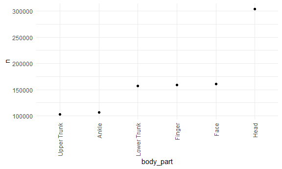
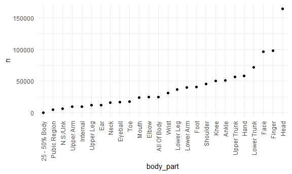
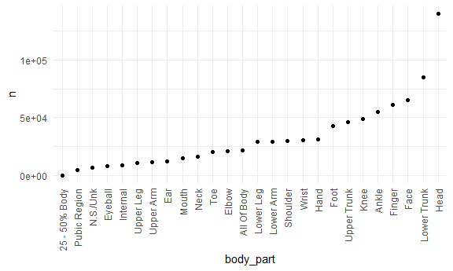
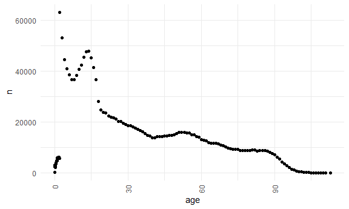

Project
================
Daniel Ojeranti
11/29/2020

``` r
# Plot of most common injured body part overall
injuries %>% 
  count(body_part) %>% 
    filter(n > 100000) %>% 
  arrange(desc(n)) %>% 
  mutate(
        body_part = factor(body_part),
        body_part = fct_reorder(body_part, n)
    ) %>% 
  ggplot(aes(x = body_part, y = n)) + 
    geom_point() + 
    theme(axis.text.x = element_text(angle = 90, vjust = 0.5, hjust = 1))
```



``` r
# Table of top 3 causes for the top three injured body parts

injuries %>% 
    filter(body_part %in% c("Head", "Face", "Finger")) %>%
    group_by(body_part) %>% 
    count(prod1) %>% 
    mutate(rank = min_rank(desc(n))) %>% 
    filter(rank < 4) %>% 
    arrange(body_part, rank) %>% 
    knitr::kable()
```

| body\_part |  prod1|      n|  rank|
|:-----------|------:|------:|-----:|
| Face       |   1807|  13909|     1|
| Face       |   1842|  10425|     2|
| Face       |   4076|  10412|     3|
| Finger     |    464|  25350|     1|
| Finger     |   1893|  14924|     2|
| Finger     |   1205|  10751|     3|
| Head       |   1807|  44220|     1|
| Head       |   1842|  25817|     2|
| Head       |   4076|  25406|     3|

``` r
# Plot of most common injured body part for Males

injuries %>% 
  filter(sex == "Male") %>% 
  count(body_part) %>% 
  arrange(desc(n)) %>% 
  mutate(
        body_part = factor(body_part),
        body_part = fct_reorder(body_part, n)
    ) %>% 
  ggplot(aes(x = body_part, y = n)) + 
    geom_point() + 
    theme(axis.text.x = element_text(angle = 90, vjust = 0.5, hjust = 1))
```



``` r
# Table of top 3 causes for the top three injured body parts for Males

injuries %>% 
    filter(sex == "Male", body_part %in% c("Head", "Face", "Finger")) %>%
    group_by(body_part) %>% 
    count(prod1) %>% 
    mutate(rank = min_rank(desc(n))) %>% 
    filter(rank < 4) %>% 
    arrange(body_part, rank) %>% 
    knitr::kable()
```

| body\_part |  prod1|      n|  rank|
|:-----------|------:|------:|-----:|
| Face       |   1807|   6486|     1|
| Face       |   4057|   6269|     2|
| Face       |   1842|   5660|     3|
| Finger     |    464|  14490|     1|
| Finger     |   1205|   8225|     2|
| Finger     |   1893|   7420|     3|
| Head       |   1807|  19268|     1|
| Head       |   1842|  12492|     2|
| Head       |   4076|  12430|     3|

``` r
# Plot of most common injured body part for Females

injuries %>% 
  filter(sex == "Female") %>% 
  count(body_part) %>% 
  arrange(desc(n)) %>% 
  mutate(
        body_part = factor(body_part),
        body_part = fct_reorder(body_part, n)
    ) %>% 
  ggplot(aes(x = body_part, y = n)) + 
    geom_point() + 
    theme(axis.text.x = element_text(angle = 90, vjust = 0.5, hjust = 1))
```



``` r
# Table of top 3 causes for the top three injured body parts for Females

injuries %>% 
    filter(sex == "Female", body_part %in% c("Head", "Face", "Lower Trunk")) %>%
    group_by(body_part) %>% 
    count(prod1) %>% 
    mutate(rank = min_rank(desc(n))) %>% 
    filter(rank < 4) %>% 
    arrange(body_part, rank) %>% 
    knitr::kable()
```

| body\_part  |  prod1|      n|  rank|
|:------------|------:|------:|-----:|
| Face        |   1807|   7423|     1|
| Face        |   4076|   4838|     2|
| Face        |   1842|   4765|     3|
| Head        |   1807|  24952|     1|
| Head        |   1842|  13324|     2|
| Head        |   4076|  12976|     3|
| Lower Trunk |   1807|  15498|     1|
| Lower Trunk |   1842|  11668|     2|
| Lower Trunk |   4076|   6770|     3|

``` r
injuries %>% 
separate(trmt_date, c("year","month","day"), sep = "-")
```

    ## # A tibble: 1,865,651 x 20
    ##    case_num year  month day      age sex   race  race_other body_part diag 
    ##    <chr>    <chr> <chr> <chr>  <dbl> <chr> <chr> <chr>      <chr>     <chr>
    ##  1 1301049~ 2013  01    01    57     Male  White <NA>       Face      Cont~
    ##  2 1301049~ 2013  01    01     0.583 Fema~ Asian <NA>       Head      Inte~
    ##  3 1301049~ 2013  01    01    59     Fema~ White <NA>       Lower Tr~ Cont~
    ##  4 1301049~ 2013  01    01    17     Fema~ White <NA>       Ankle     Stra~
    ##  5 1301049~ 2013  01    01    38     Male  White <NA>       Finger    Lace~
    ##  6 1301049~ 2013  01    01    39     Fema~ White <NA>       Wrist     Frac~
    ##  7 1301049~ 2013  01    01     1.58  Male  Other hisp       All Of B~ Pois~
    ##  8 1301050~ 2013  01    01    10     Fema~ Not ~ <NA>       Foot      Stra~
    ##  9 1301052~ 2013  01    01    37     Male  White <NA>       Knee      Lace~
    ## 10 1301052~ 2013  01    01    34     Male  White <NA>       Ankle     Stra~
    ## # ... with 1,865,641 more rows, and 10 more variables: diag_other <chr>,
    ## #   disposition <chr>, location <chr>, fmv <chr>, prod1 <dbl>, prod2 <dbl>,
    ## #   stratum <chr>, psu <dbl>, weight <dbl>, narrative <chr>

``` r
injuries %>% 
  count(age) %>% 
  arrange(desc(n)) %>% 
  ggplot(aes(x = age, y = n)) + 
    geom_point() + 
    theme(axis.text.x = element_text(angle = 90, vjust = 0.5, hjust = 1))
```


