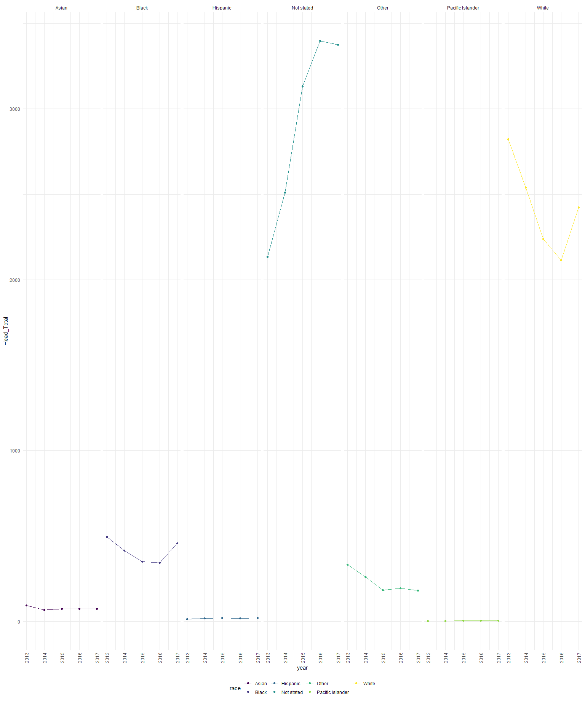

Consumer product-related injuries in the United States
================

``` r
library(tidyverse)
library(readxl)
library(ggridges)
library(patchwork)
library(dplyr)

knitr::opts_chunk$set(
  fig.width = 16,
  fig.asp = 1.2,
  out.width= "90%"
)


theme_set(theme_minimal() + theme(legend.position = "bottom"))
          

options(
    ggplot2.continuous.colour= "viridis" ,
    ggplot2.continuous.fill = "viridis"
)        


scale_colour_discrete = scale_color_viridis_d
scale_fill_discrete = scale_fill_viridis_d
```

``` r
library(neiss)
```

``` r
data("injuries")
data("population")
data("products")

head(population)
```

    ## # A tibble: 6 x 4
    ##    year   age sex          n
    ##   <int> <int> <chr>    <int>
    ## 1  2013     0 female 1921491
    ## 2  2013     0 male   2009717
    ## 3  2013     1 female 1926877
    ## 4  2013     1 male   2015564
    ## 5  2013     2 female 1949297
    ## 6  2013     2 male   2041998

``` r
head(injuries)
```

    ## # A tibble: 6 x 18
    ##   case_num trmt_date     age sex   race  race_other body_part diag  diag_other
    ##   <chr>    <date>      <dbl> <chr> <chr> <chr>      <chr>     <chr> <chr>     
    ## 1 1301049~ 2013-01-01 57     Male  White <NA>       Face      Cont~ <NA>      
    ## 2 1301049~ 2013-01-01  0.583 Fema~ Asian <NA>       Head      Inte~ <NA>      
    ## 3 1301049~ 2013-01-01 59     Fema~ White <NA>       Lower Tr~ Cont~ <NA>      
    ## 4 1301049~ 2013-01-01 17     Fema~ White <NA>       Ankle     Stra~ <NA>      
    ## 5 1301049~ 2013-01-01 38     Male  White <NA>       Finger    Lace~ <NA>      
    ## 6 1301049~ 2013-01-01 39     Fema~ White <NA>       Wrist     Frac~ <NA>      
    ## # ... with 9 more variables: disposition <chr>, location <chr>, fmv <chr>,
    ## #   prod1 <dbl>, prod2 <dbl>, stratum <chr>, psu <dbl>, weight <dbl>,
    ## #   narrative <chr>

``` r
head(products)
```

    ## # A tibble: 6 x 2
    ##    code title                                   
    ##   <int> <chr>                                   
    ## 1   101 washing machines without wringers or oth
    ## 2   102 wringer washing machines                
    ## 3   103 washing machines with unheated spin drye
    ## 4   106 electric clothes dryers without washers 
    ## 5   107 gas clothes dryers without washers      
    ## 6   108 mangle irons

Head and Neck Injuries by Race Requiring Admission Between 2013-2017
====================================================================

``` r
race_head=
  injuries %>% 
     select(trmt_date, race, race_other, body_part, disposition, prod1, prod2
  ) 
```

``` r
race_headdf=
race_head %>%
filter(body_part %in% c ("Head", "Face", "Neck",  "Ear", "Eyeball"),
        disposition == "Admitted") %>%   
  separate(trmt_date, into = c("year", "month", "day"), convert = TRUE) %>% 
  group_by (body_part) %>% 
  count(race) %>% 
  arrange(race) %>% 
  pivot_wider(
  names_from = "race", 
  values_from = "n") %>% 
     knitr::kable(digits = 2)

race_headdf
```

| body\_part |  Asian|  Black|  Hispanic|  Not stated|  Other|  Pacific Islander|  White|
|:-----------|------:|------:|---------:|-----------:|------:|-----------------:|------:|
| Ear        |      1|     19|         1|          71|     14|                 1|     66|
| Eyeball    |      3|     50|        NA|         210|     38|                NA|    140|
| Face       |     88|    655|        23|        2729|    310|                 1|   2722|
| Head       |    381|   2059|        86|       14549|   1149|                18|  12138|
| Neck       |     31|    212|         9|        1464|     65|                 1|   1336|

From the table above, we observe that the largest number of head injuries were observed in "Not Stated," "White," followed by "Black."

Summarize Head Injury Requiring Admission in each Race over 2013-2017
---------------------------------------------------------------------

``` r
race_head %>%
filter(body_part %in% c ("Head"),
        disposition == "Admitted") %>%   
  separate(trmt_date, into = c("year", "month", "day"), convert = TRUE) %>%
  select (-month, -day, -race_other, -disposition, -prod1, -prod2) %>% 
  group_by(body_part, race, year) %>% 
  count(body_part, name = "Head_Total") %>% 
  ggplot(aes(x = year, y = Head_Total, color=race)) + 
  geom_line()+
  geom_point()+
  facet_grid(~ race)+
  theme(axis.text.x = element_text(angle = 90, vjust = 0.5, hjust = 1))
```


